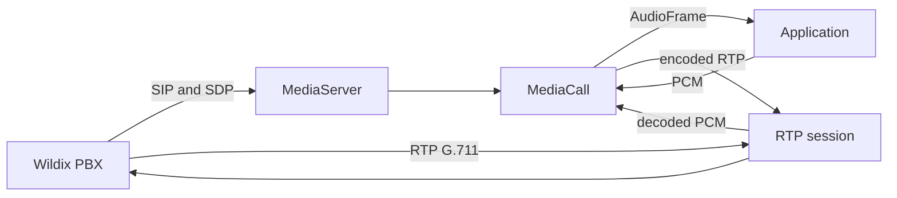

# Architecture

## Purpose

Wildix Media SDK provides a narrow transport boundary between telephony media and an
application. It accepts an inbound call, negotiates a supported codec, converts RTP
payloads to PCM, and converts outgoing PCM back to RTP.

The SDK does not decide what the caller said or what the system should say. This keeps
telephony concerns independently testable from AI-provider and domain concerns.

## Component Model



| Module | Responsibility |
| --- | --- |
| `server.py` | Listener lifecycle, SIP call acceptance, SDP, and resource ownership |
| `call.py` | Call-scoped asynchronous PCM and DTMF interface |
| `config.py` | Validated local and advertised network configuration |
| `ports.py` | Concurrent RTP port allocation |
| `models.py` | Immutable media and keypad events |
| `recording.py` | Optional decoded PCM persistence as WAV |
| `cli.py` | Installation-level diagnostic command |

The protocol implementation is delegated to `aiosipua[rtp]`, including its RTP
dependency. The SDK wraps that lower-level API so applications do not parse SIP, SDP,
RTP headers, jitter, or G.711 payloads themselves.

## Call Lifecycle

1. `MediaServer` receives an INVITE and validates the SDP offer.
2. It allocates one local RTP port and selects PCMA or PCMU.
3. The server returns an SDP answer containing the configured advertised media address.
4. A `MediaCall` is passed to one asynchronous application handler.
5. Incoming RTP is decoded and queued as immutable `AudioFrame` values.
6. Application PCM is encoded and transmitted by `send_frame()` or `play_pcm()`.
7. BYE, local hangup, handler completion, or server shutdown releases all resources.

## Real-Time Behavior

Every call has a bounded incoming queue. If an application consumes audio too slowly,
the oldest unread frames are discarded. Preserving current audio is more useful than
building unbounded conversational latency.

`send_frame()` assumes the caller provides an already paced stream. `play_pcm()` splits
a complete buffer into configured packet durations and paces transmission against the
event-loop clock.

## Concurrency

Each active call consumes one RTP port. The maximum simultaneous call count is therefore
bounded by the inclusive `RTP_PORT_START` to `RTP_PORT_END` range. A one-port tunnel can
serve one concurrent call. Production deployments should expose a contiguous RTP range.

## Trust Boundary

The listener currently accepts direct inbound SIP without authentication. It is suitable
for source-restricted development networks and tunnel validation, not unrestricted
Internet exposure. Registration, authentication, encrypted signaling, and encrypted
media belong in a future transport adapter or a hardened SIP proxy in front of the SDK.

## Extension Boundary

An AI application should depend only on `MediaCall` and `AudioFrame`:

```text
MediaCall.audio_frames -> VAD/turn detection -> ASR -> LLM/RAG -> TTS -> MediaCall.play_pcm
```

This dependency direction allows providers and agent behavior to change without
modifying the SIP/RTP layer.
